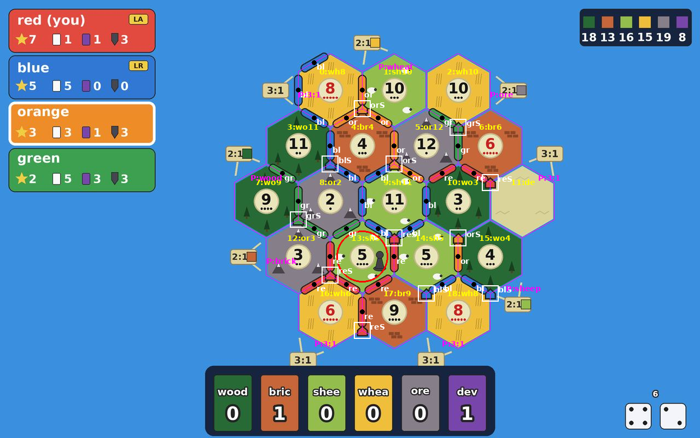

# catanbot

An ML-trained Settlers of Catan bot for 3-4 player games that

* **plays**: expectimax search over dice / draws / steals / trade acceptance
  with a self-play-trained value network at the leaves, max^n opponent
  simulation and hidden-hand determinization;
* **thinks like a good player**: explicit logic for bank vs port vs player
  trading, 7-protection, knight timing, dev-card buying, card counting,
  placement, and
* **plays politics**: exploitative opponent profiles (implied valuations,
  acceptance habits, robber targets) with decay, political capital between
  players, target pressure on the visible leader, game-stage-aware trading and
  kingmaker-lite moves - the objective is win probability, not VP;
* **reads Colonist.io screenshots**: a computer-vision parser (and an optional
  Claude-vision parser) turns a screenshot into a game state and the bot
  recommends the move with explanations.

```bash
pip install -e . opencv-python-headless
python -m catanbot analyze screenshot.png --me red          # what should I do?
python -m catanbot play --bots search,heuristic,heuristic,heuristic --verbose
python -m catanbot train --iters 6 --games 150 --workers 4  # self-play training
python -m pytest -q                                          # tests
```

See `docs/USAGE.md` for every command and the `--fix` / `--event` syntax,
`docs/STRATEGY.md` for how the bot decides, `docs/DESIGN.md` for the module
contracts.

## Layout

| module | what |
| --- | --- |
| `catanbot/board.py`, `state.py`, `actions.py`, `engine.py` | complete base-game rules (setup, production, robber, dev cards, awards, bank/port/player trades) |
| `heuristic.py`, `placement.py`, `trading.py`, `discard.py`, `robber.py`, `danger.py`, `devcards.py`, `counting.py`, `inference.py` | strategy modules (incl. distance-to-win targeting and steal exposure) and card counting / determinization |
| `opponent_model.py`, `politics.py` | exploitative opponent profiles, political capital, coalitions |
| `features.py`, `model.py`, `selfplay.py`, `train.py` | 302-dim features, numpy value net, self-play data + training loop |
| `search.py`, `agents/` | expectimax + beam search, the bots |
| `vision/` | Colonist.io parsers (`colonist.py` CV, `llm.py` Claude), live screen reader (`live.py`), synthetic renderer, digit classifier, state schema, UI profile |
| `cli.py` | `analyze`, `recommend`, `watch`, `ocr`, `ocr-teach`, `ui-profile`, `play`, `eval`, `train`, `render`, `profiles` |

## Screenshot parsing

`python -m catanbot analyze shot.png --me red --debug overlay.png`



On synthetic Colonist-style renders (four resolutions, 3-4 players, jitter
and JPEG compression) the parser reads the board geometry, all 19 tiles,
all 18 numbers, the robber, every road and building, the panel numbers,
the hand and the dice correctly; ports hidden under the hand bar are
reported as missing and can be added with `--fix "port 66=3:1"`.  Real
screenshots use the same pipeline (the token discs anchor the lattice, the
standard tile / number multisets constrain the classification); anything
uncertain is flagged and correctable with `--fix`.

## Live local reader (no API)

`watch` reads the Colonist.io screen live on your machine - board, player cards and game log - and
prints each new log entry, an accept / reject / counter verdict the moment an opponent offers a
trade, the card count (`--session`) and the top moves when the position changes.  Unchanged frames
cost a few milliseconds; popups, scrolling and misread frames do not corrupt the board or the count.
Set it up once per screen (see `docs/USAGE.md`, "Live local reader"):

```bash
python -m catanbot ui-profile screen.json --detect shot.png              # where the log panel is
python -m catanbot ocr shot.png --ui-profile screen.json --debug ocr.png  # check the log reading
python -m catanbot ocr-teach shot.png --truth truth.txt --ui-profile screen.json
python -m catanbot watch --me red --interval 2 --ui-profile screen.json --session game1.json --record rec1
```

## Training and strength

`python -m catanbot train` runs the self-play loop (see `docs/USAGE.md`).
Results of the training run shipped in `models/value_net.npz` are in
`docs/RESULTS.md`.
Champion league and promotion gate for every new training run / strategy (exact old bots, sequential tests): `docs/LEAGUE.md`.
